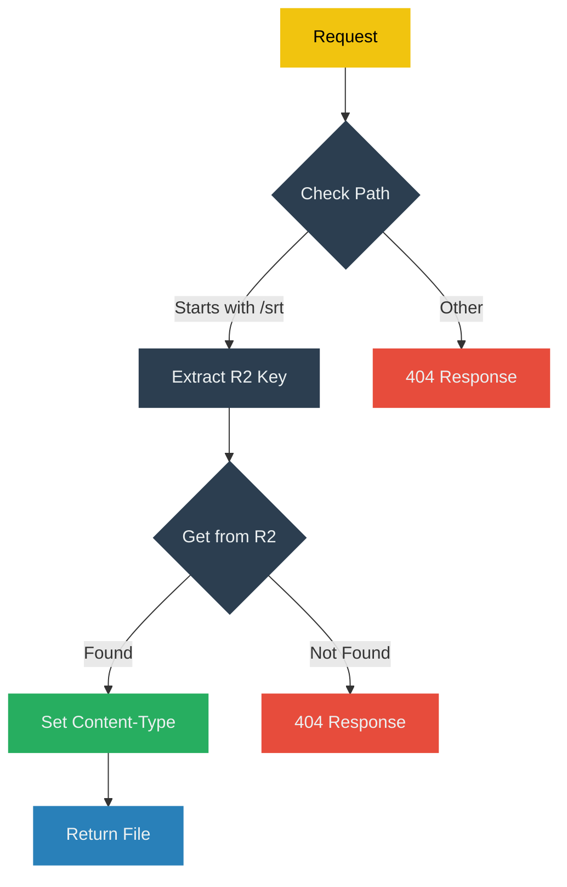

# DeepSRT Provider

A Cloudflare Worker template that allows you to deploy your own DeepSRT Provider on Cloudflare. This provider serves as a static file server for SRT files stored in Cloudflare R2 storage.

## Overview

This worker provides direct URL mapping to R2 bucket objects, specifically designed to serve subtitle files (.srt) from a Cloudflare R2 bucket. This implementation follows the [DeepSRT Provider RFC](https://github.com/DeepSRT/roadmap/issues/15) which defines the standard interface for DeepSRT Providers.

This project is designed to be ready to use out-of-the-box, allowing you to build and deploy a fully functional DeepSRT provider on Cloudflare with minimal configuration. Simply set up your R2 bucket, deploy the worker, and you'll have a production-ready subtitle provider service.

## URL Mapping

The worker maps URLs directly to R2 bucket paths:

* `https://worker_name.sub_domain.workers.dev/srt/` → `s3://{bucket_name}/srt/`
* `https://worker_name.sub_domain.workers.dev/srt/Ty3wqBxb0UE/default/Ty3wqBxb0UE.srt` → `s3://{bucket_name}/srt/Ty3wqBxb0UE/default/Ty3wqBxb0UE.srt`

### URL Format Structure

The URL format follows this pattern:

```plaintext
https://worker_name.sub_domain.workers.dev/srt/{videoId}/{languageCode}/{videoId}.srt
```

Where:

  * `worker_name.sub_domain.workers.dev`: Your Cloudflare Worker's domain
  * `srt/`: Base path for subtitle files
  * `{videoId}`: Unique identifier for the video (typically a YouTube video ID)
  * `{languageCode}`: Language identifier for the subtitle (e.g., 'default', 'en', 'zh-tw')
  * `{videoId}.srt`: The actual subtitle file (named with the video ID)

This maps to the following R2 storage path:

```plaintext
s3://{bucket_name}/srt/{videoId}/{languageCode}/{videoId}.srt
```

This direct mapping allows efficient organization and retrieval of subtitle files by video ID and language.

## Flow Diagram



## Setup

1. Clone this repository
2. Install dependencies:

   ```bash
   npm install
   ```

3. Configure your R2 bucket in `wrangler.jsonc`:

   ```jsonc
   {
     "r2_buckets": [
       {
         "binding": "DEEPSRT_BUCKET", // Name of the binding. Do not change.
         "bucket_name": "${your_bucket_name}" // Name of your R2 bucket
       }
     ]
   }
   ```

## Quick Start

You can quickly bootstrap a new DeepSRT Provider project using the following command:

```bash
npm create cloudflare@latest <YOUR_PROJECT_NAME> -- --template=DeepSRT/deepsrt-provider
```

This will create a new project based on this template with all the necessary files and configurations.

## Development

```bash
# Start local development server
npm run dev

# Deploy to Cloudflare Workers
npm run deploy
```

## Features

*   Direct path mapping from URLs to R2 objects
*   Proper content type headers for SRT files
*   Error handling for missing files
*   Simple and efficient request processing

## Requirements

*   Cloudflare Workers account
*   Cloudflare R2 bucket configured
*   Node.js and npm installed locally
