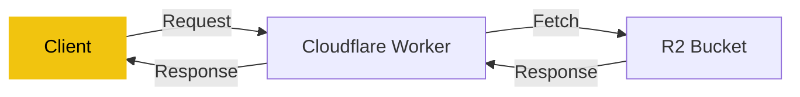
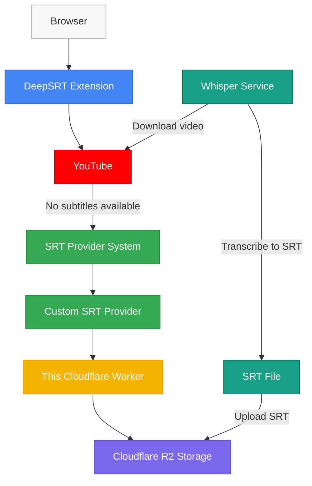

# DeepSRT Provider

A Cloudflare Worker template that allows you to deploy your own DeepSRT Provider on Cloudflare. This provider serves as a static file server for SRT files stored in Cloudflare R2 storage.

## Overview

This worker provides direct URL mapping to R2 bucket objects, specifically designed to serve subtitle files (.srt) from a Cloudflare R2 bucket. This implementation follows the [DeepSRT Provider RFC](https://github.com/DeepSRT/roadmap/issues/15) which defines the standard interface for DeepSRT Providers.

This project is designed to be ready to use out-of-the-box, allowing you to build and deploy a fully functional DeepSRT provider on Cloudflare with minimal configuration. Simply set up your R2 bucket, deploy the worker, and you'll have a production-ready subtitle provider service.

## URL Mapping

The worker maps URLs directly to R2 bucket paths:

- `https://worker_name.sub_domain.workers.dev/srt/` → `s3://{bucket_name}/srt/`
- `https://worker_name.sub_domain.workers.dev/srt/Ty3wqBxb0UE/default/Ty3wqBxb0UE.srt` → `s3://{bucket_name}/srt/Ty3wqBxb0UE/default/Ty3wqBxb0UE.srt`

## URL Format Structure

The URL format follows this structure:

- `{worker_domain}/srt/{video_id}/{language}/{video_id}.srt`

Where:

- `{worker_domain}` is your Cloudflare Worker domain
- `{video_id}` is the YouTube video ID
- `{language}` is the language code (e.g., 'en', 'zh-TW')

## Cache Strategy

The worker implements a cache strategy to improve performance:

- Cache hits are served directly from Cloudflare's edge cache
- Cache misses are fetched from R2 and then cached
- Cache-Control headers are set to optimize caching behavior
- Etag headers are used for validation

## Error Handling

The worker provides appropriate error responses:

- 404 Not Found for missing files
- 500 Internal Server Error for R2 access issues

## Architecture



## Quick Start

You can quickly bootstrap a new DeepSRT Provider project using the following command:

```bash
npm create cloudflare@latest <YOUR_PROJECT_NAME> -- --template=DeepSRT/deepsrt-provider
```

This will create a new project based on this template with all the necessary files and configurations.

## Setup

1. Install dependencies:

   ```bash
   npm install
   ```

2. Configure your R2 bucket in `wrangler.jsonc`:

   ```jsonc
   {
     "r2_buckets": [
       {
         "binding": "DEEPSRT_BUCKET",
         "bucket_name": "${your_bucket_name}"
       }
     ]
   }
   ```

## Development

```bash
# Start local development server
npm run dev

# Deploy to Cloudflare Workers
npm run deploy
```

## DeepSRT Ecosystem

The following diagram illustrates how the DeepSRT Provider fits into the broader DeepSRT ecosystem:



### User Flow

When a user watches a YouTube video:

1. The DeepSRT browser extension first tries to load subtitles from YouTube's native API
2. If no subtitles are available, the extension falls back to configured SRT providers
3. Your custom DeepSRT Provider (this Cloudflare Worker) serves SRT files from your R2 storage
4. The extension displays the subtitles to the user in the browser

### Whisper Transcription Flow

To populate your R2 storage with SRT files:

1. The Whisper service downloads videos from YouTube
2. Whisper transcribes the audio into SRT format
3. The generated SRT files are uploaded to your R2 storage
4. These SRT files are now available to be served by your DeepSRT Provider

This template allows you to quickly deploy your own DeepSRT Provider that can be configured in the extension, enabling subtitle support for videos that don't have official captions.

## Features

- Direct path mapping from URLs to R2 objects
- Proper content type headers for SRT files
- Error handling for missing files
- Simple and efficient request processing

## Requirements

- Cloudflare Workers account
- Cloudflare R2 bucket configured
- Node.js and npm installed locally
